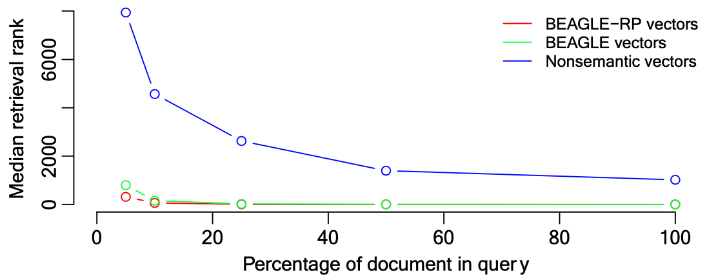

```{r setup, include=FALSE}
knitr::opts_chunk$set(echo = FALSE)

# Learn more about creating blogs with Distill at:
# https://rstudio.github.io/distill/blog.html

```

# 📄 Article

<aside>
  # Psychological Review
  <dl>
    <dt>__1986__</dt>
    <dt>Vol. 93,No. 4, 411-428</dt>
  </dl>
</aside>

## "Schema Abstraction" in a Multiple-Trace Memory Model[@hintzman_schema_1986]

Douglas L. Hintzman | University of Oregon

### Highlights & Notes

In Hintzman\'s theory of schema abstraction — experiences are assumed to be represented by several internalized properties:

- Properties of emotional tones and modality-specific sensory features (e.g. basic colors and odors)

- Properties accessible by more than 1 modality (e.g. intermittency,spatial location)

- Properties of primitive abstract relations (e.g. before, same as, greater than, has as parts)

These properties are not acquired by the experience, but the ability to label them seems to be. Experiences share these properties, and the similarity of any multiple experiences is related to the amount of properties they share. **The model accounts for episodic and generic memories within a single system.**

Considering this model, Hintzman notes that there seems to be 2 ways people learn to classify objects and events.

1. Through the presentation and naming of categories. (e.g. dogs from cats)

2. Through explicit communication about definitions and exceptions. (e.g. concept of prime numbers & bats are not birds)

> "The model assumes that **each experience produces a separate memory trace** and that **knowledge** of abstract concepts **is derived from the pool of episodic traces** at the time of retrieval." \— p.411.

**Memory Trace** - A record of an experience preserving the configuration of properties.

- **Primary memory trace (PM)** - The active representation of the current experience.

- **Secondary memory trace (SM)** - The vast pool of largely dormant memory traces.

> "Every conscious experience gives rise to its own **memory trace**, no matter how similar it may be to an earlier one." \— p.412.

Activation of a memory trace implies activation of all its primitive properties via a probe. Properties shared with the probe spreads to the memory trace's other properties — and returns as an echo.

**Characteristics of an echo:**

- Intensity

- Content

> "In a system such as this, the **structure of the probe is crucial**, because it **determines** which particular **combination of SM traces** will contribute importantly to the **echo.**" \— p.412.

This activation process is associative learning.

#### MINERVA 2

- A simulation model of episodic memory.

- The model is able to retrieve and disambiguate a prototype of a category when probed with an alias.

- The model predicts other basic findings from other schema-abstraction theories an literature.

> "Computation of the echo in MINERVA 2 can be seen as an information-processing analog of Semon's notion of homophony." \— p.426.

#### Discussion Questions

1. What is today's equivalent of the MINERVA 2 model?
2. How does schema-abstraction relate to other theories of learning and development such as Vygotsky's ZPD?

***

# 📄 Article

<aside>
  # Behavior Research Methods
  <dl>
    <dt>__2019__</dt>
    <dt>The Psychonomic Society, Inc.</dt>
  </dl>
</aside>

## The Semantic Librarian: A search engine built from vector-space models of semantics[@aujla_semantic_2019]

Harinder Aujla | University of Winnipeg

Matthew J. C. Crump | Brooklyn College

Matthew T. Cook | University of Manitoba

Randall K. Jamieson | University of Manitoba

### Highlights & Notes

Keyword matching suffers several shortcomings:

- Assumes a simple relationship between a word and it's meaning.

- Keyword search can be blind where meaning overlaps but vocabulary differs.

- Keyword search restricted to the user’s vocabulary.

#### Vector-space models of semantics

Since the 1940s, scientists have worked to find a quantitative representation of a word's meaning. Beginning in the 1990s, the analysis of word semantics pushed forward with the creation of **corpus-based vector-space models** to ultimately find efficient, broad, and deep analysis of word meaning derived from semantic patterns in printed text (e.g., newspapers and encyclopedias).

**Latent semantic analysis (LSA)** - 1st generation

- LSA derives Word meaning from a text corpus by calculating word co-occurrence in a word-by-document matrix.


**Bound Encoding of the Aggregate Language Environment (BEAGLE)** - 2nd generation

- BEAGLE “reads” a text corpus and, on route, encodes a vector that represents the meaning of each word in that corpus. 

**BEAGLE Random Permutation (BEAGLE-RP)** - improvement upon BEAGLE

- BEAGLE-RP is practically consistent with BEAGLE, but applies a different method to build the semantic vectors.

#### The Corpus
- 27,560 documents
- 40,517 words scraped (i.e., titles, abstracts, author names, and keywords)

#### Simulation 1: Recovering a target document


<figure>
```{r}
knitr::include_graphics("img/sim1.png")
```
  **Figure 1**
  <figcaption>
    1,000 simulations of queries composed of 5%, 10%, 25%, 50%, and 100% of the words from each document’s provided abstract, title, and keywords. 
  
  If more than 25% of the words in the document were included in the query, all methods retrieved the target document at median rank = 1.
  </figcaption>
</figure>

#### Simulation 2: Comparison of semantic and nonsemantic vector methods
<figure>
```{r}

```
  **Figure 2**
  <figcaption>
  Both semantic methods recovered the target document much better than the nonsemantic method.
  
  This methods affords users to express the intent of their query while not being required to use the exact words in the document they are looking to find.
  </figcaption>
</figure>

#### Simulation 3: Relationship between semantic and nonsemantic search
<figure>
```{r}
knitr::include_graphics("img/sim3.png")
```
  **Figure 3**
  <figcaption>
  Simulation 3 — a repetition of Simulation 1 — but measured the agreement (i.e. Spearman rank correlation) among document ranks returned.
  
  Agreement between the returned results list from all methods improves with the percentage of words included in the input query.
  </figcaption>
</figure>

> "We view the difference between traditional and psychologically inspired cognitive computing to be analogous to the difference between traditional and biologically inspired engineering, in which scientists leverage the lessons and study of natural cognitive systems to solve complex applied problems." \—p.11.

This research shows that a descriptive theory of semantics can inform a meaningful search engine interface.

#### Discussion Questions

1. How similar are these systems (LSA. BEAGLE, BEAGLE-RP) when compared to the Google search engine?

2. How does the system take into account a broader or a dynamic corpus? 

3. We hear a lot about search engines/AI being biased. How do we know a "corpus" of information won't bias a word's meaning?

***

# 📄  Article

<aside>
  # Canadian Journal of Experimental Psychology
  <dl>
    <dt>__July 25, 2019__</dt>
    <dt>Canadian Psychological Association</dt>
  </dl>
</aside>

## Instance Theory Predicts Information Theory: Episodic Uncertainty as a Determinant of Keystroke Dynamics [@crump_instance_2019]

Matthew J. C. Crump | Brooklyn College & Graduate Center at CUNY

Walter Lai | Brooklyn College

Nicholaus P. Brosowsky | Brooklyn College & Graduate Center at CUNY

### Highlights & Notes

The study examines typing as a task in order to investigate the underlying cognitive processes involved in sequence of skilled actions.

**Research question** - Are more predictable letters typed faster than less predictable letters?

**Modeling Uncertainty with the Instance Theory** - Instance theory assumes that memory traces are retrieved by comparative similarity to a probe or environmental stimuli. The more a stimuli is "practiced", the better it's chance of retrieving a quick response than a less practiced stimuli. A new memory trace is stored each time a response is given to a probe. When a familiar probe is encountered again, it automatically starts the retrieval of all stored traces of the familiar probe.

**Context, Updating, and Retrieval (CRU)** - Vector-based context representations for letters.

It is suggested that information theory can be utilized to identify the natural structure surrounding individual letters.

- Interkeystroke intervals (IKSIs)

- *H* measures the entropy or uncertainty

**Results** - The average interkeystroke interval varies when considering letter position and word length. These variations in typing at the character level (the rate a which someone types specific letters) is explained by the statistics of letter occurrences as they would appear in natural text. 

> "Our findings fit well with prior work showing instance-based influences over typing performance, and sequencing in general." \— p.11.


#### Discussion Questions

1. How would this relate to other reading phenomena concerning influences of the exterior and interior letters of words.(e.g. scrambled letters still read)? 
